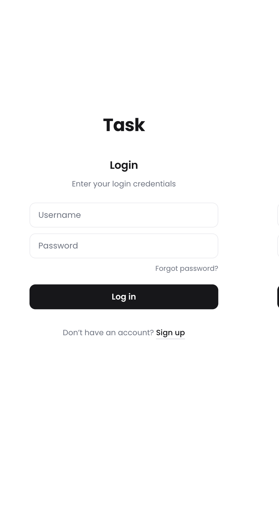
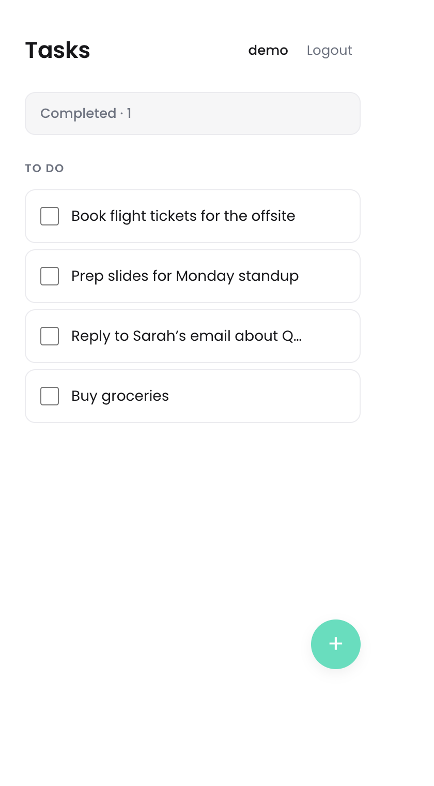
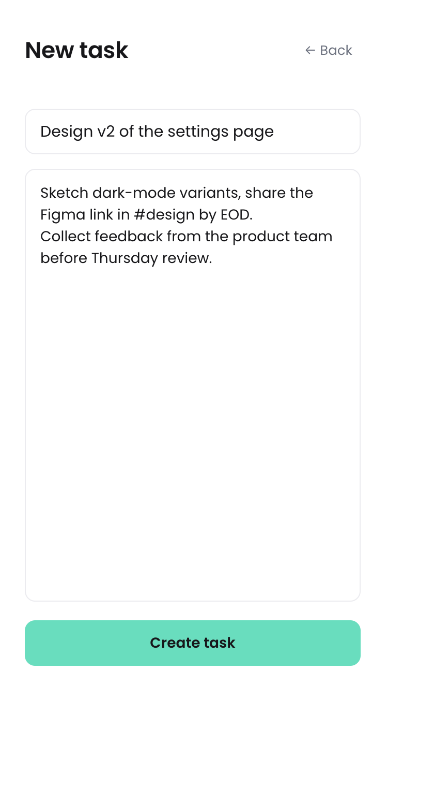

# Task

A simple todo app with authentication. Sign up, log in, and manage your personal task list.

## Screenshots

| Login | Tasks |
| :---: | :---: |
|  |  |

| Create task | Completed |
| :---: | :---: |
|  |  |

## Tech stack

- **Frontend:** React 18, Vite, React Router, Axios
- **Backend:** Node.js, Express, Mongoose (MongoDB)
- **Auth:** JWT (signed with [`jose`](https://www.npmjs.com/package/jose), stored in `localStorage`), passwords hashed with bcrypt

## Features

- Signup / login with JWT auth (passwords hashed with bcrypt)
- Create, read, update, delete tasks
- Toggle tasks completed / view completed tasks on a separate page
- Todos are scoped per user — you only see your own
- Protected routes on the frontend; token auto-attached to API calls

## Project structure

```
.
├── src/                 # React + Vite frontend
│   ├── components/      # Login, Signup, Todo, CreateTodo, UpdateTodo, ...
│   └── lib/             # api client + auth helpers
├── server/              # Express + MongoDB API
│   ├── db/              # mongoose models (User, Todo)
│   ├── middleware/      # JWT auth middleware
│   └── routes/          # /api/users, /api/todos
└── vite.config.js       # proxies /api -> http://localhost:3000 in dev
```

## Prerequisites

- Node.js 18+
- A MongoDB connection string (e.g. from MongoDB Atlas)

## Quick start

Run the backend and frontend in two separate terminals.

### 1. Backend

```bash
cd server
cp .env.example .env    # then edit .env with your values
npm install
npm run dev             # listens on http://localhost:3000
```

Required env vars (see [`server/.env.example`](server/.env.example)):

| Variable     | Description                                                 |
| ------------ | ----------------------------------------------------------- |
| `MONGO_URI`  | MongoDB connection string (include the database name)       |
| `JWT_SECRET` | Long random string used to sign JWTs                        |
| `PORT`       | Optional. Port the API listens on (defaults to `3000`)      |

### 2. Frontend

```bash
npm install
npm run dev             # opens http://localhost:5173
```

The Vite dev server proxies `/api/*` to the backend at `http://localhost:3000`, so no CORS setup is needed in development.

## API

All `/api/todos/*` endpoints require an `Authorization: Bearer <token>` header. The token is returned by signup / login.

| Method | Path                | Auth | Description                     |
| ------ | ------------------- | :--: | ------------------------------- |
| POST   | `/api/users/signup` |  –   | Create user, returns token      |
| POST   | `/api/users/login`  |  –   | Login, returns token            |
| GET    | `/api/users/me`     |  ✓   | Current user                    |
| GET    | `/api/todos`        |  ✓   | List current user's todos       |
| POST   | `/api/todos`        |  ✓   | Create todo                     |
| GET    | `/api/todos/:id`    |  ✓   | Get one todo                    |
| PUT    | `/api/todos/:id`    |  ✓   | Update todo (title/desc/completed) |
| DELETE | `/api/todos/:id`    |  ✓   | Delete todo                     |

### Request examples

```bash
# Signup
curl -X POST http://localhost:3000/api/users/signup \
  -H 'Content-Type: application/json' \
  -d '{"username":"alice","password":"secret123"}'

# Create a todo
curl -X POST http://localhost:3000/api/todos \
  -H 'Content-Type: application/json' \
  -H "Authorization: Bearer $TOKEN" \
  -d '{"title":"Buy milk","description":"2L skim"}'
```

## Building for production

```bash
npm run build       # outputs the static frontend to dist/
cd server && npm start
```

In production, host the API and frontend on the same origin (or configure CORS on the API), and serve the built frontend (`dist/`) from any static host.

## Security notes

- **Do not commit `server/.env`.** It's already listed in `server/.gitignore`.
- If any credentials were ever committed to git history, rotate them.
- The JWT is stored in `localStorage` for simplicity. For a hardened setup, consider using HTTP-only cookies with a CSRF strategy.
